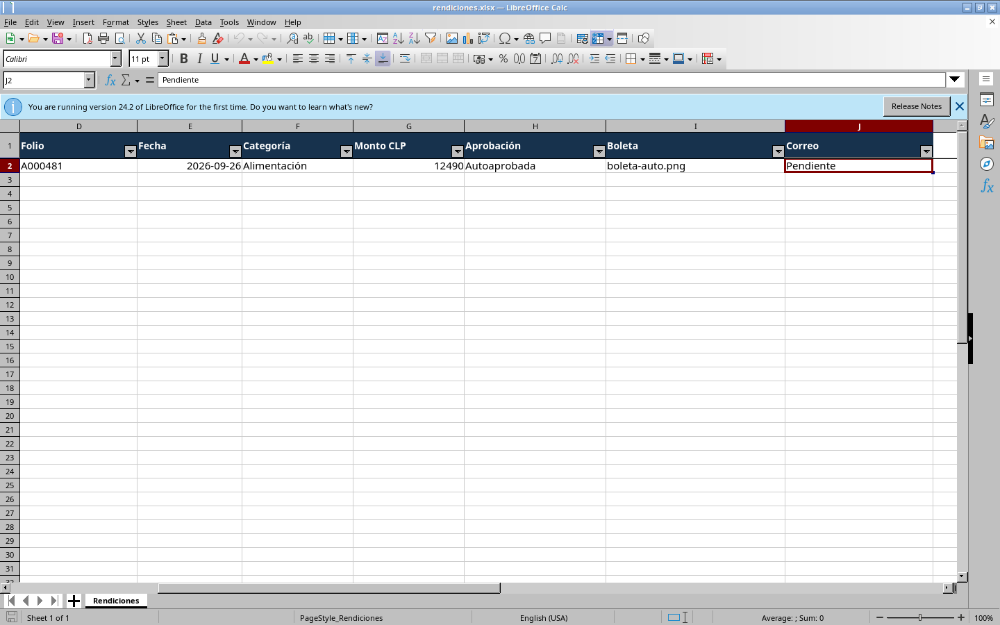
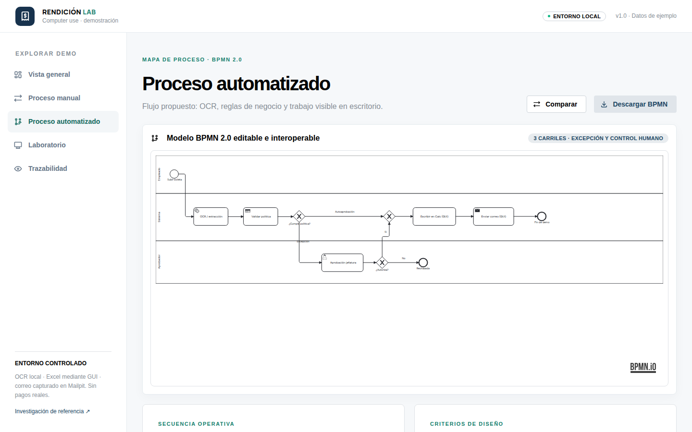
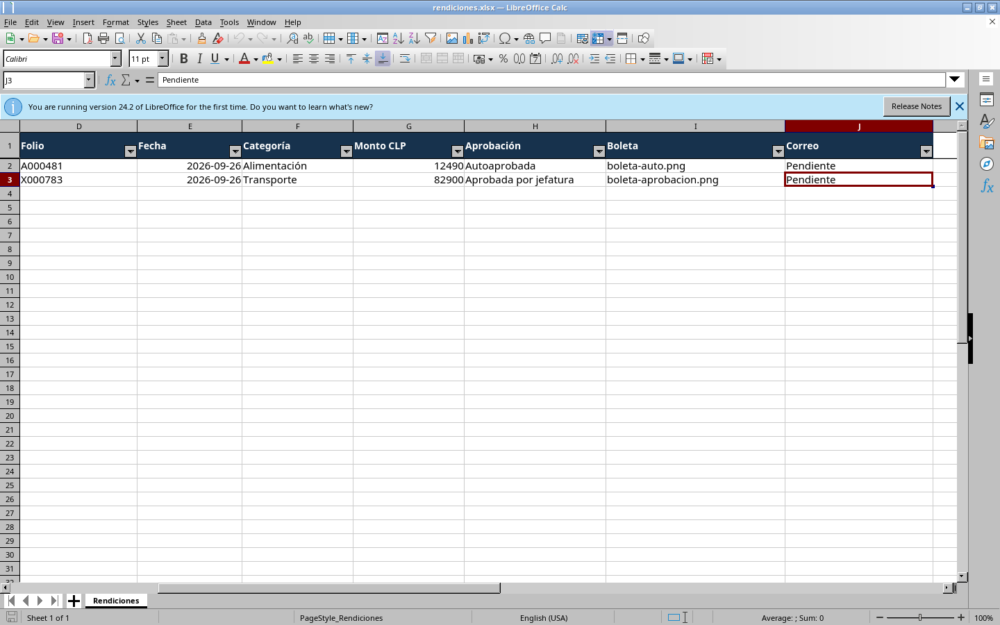
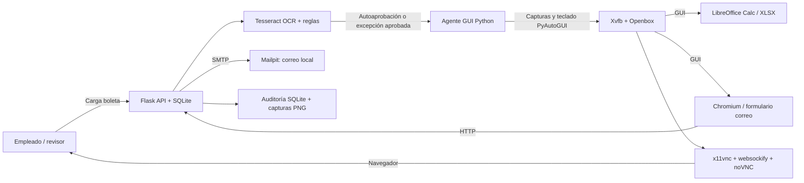

# Rendición de gastos con Computer Use y noVNC

**Laboratorio reproducible:** una persona carga una boleta, el sistema lee sus datos, evalúa una política, el agente opera **LibreOffice Calc por interfaz gráfica**, y finalmente abre **Chromium** para enviar un correo con la planilla y la boleta adjuntas. Todo ocurre en un escritorio Linux visible desde **noVNC**. Se incluyen dos diagramas **BPMN 2.0** editables, la interfaz Mantine, boletas sintéticas, trazabilidad, capturas y pruebas.

> **Alcance honesto.** Esta implementación está **inspirada en** la investigación [Hybrid Routing Agent](https://github.com/redai-studio/hybrid-routing-agent) y en su [Space de Hugging Face](https://huggingface.co/spaces/hugging-apps/hybrid-routing-agent), pero **no ejecuta su checkpoint Qwen3-VL, ni su entrenamiento RL/OSWorld, ni reutiliza su código**. El Space original predice **una sola acción** a partir de una captura; no controla un escritorio vivo. Este repositorio implementa por separado un agente **determinista** con PyAutoGUI y escritorio vivo. Véase [comparación técnica](#relación-con-las-referencias).


## Qué se puede ver

| Vista | Evidencia real |
| --- | --- |
| **Proceso manual** | [BPMN con cuatro carriles, corrección y aprobación](docs/images/02-bpmn-manual.png) |
| **Proceso automatizado** | [BPMN con OCR, decisión exclusiva, excepción y ruta GUI](docs/images/03-bpmn-automatizado.png) |
| **Laboratorio** | [Carga de boleta, ejecución y estado](docs/images/04-laboratorio.png) |
| **Computer use / Excel** | [Captura durante escritura visible en LibreOffice Calc](docs/images/05-calc-computer-use.png) |
| **Computer use / correo** | [Composición en Chromium dentro del escritorio](docs/images/06-correo-interfaz.png) |
| **Correo de prueba** | [Mensaje y adjuntos capturados por Mailpit](docs/images/07-mailpit-correo.png) |
| **Trazabilidad** | [Cronología y capturas por rendición](docs/images/08-trazabilidad.png) |
| **Escritorio remoto** | [Cliente noVNC conectado](docs/images/09-novnc-escritorio.png) |
| **Excepción aprobada** | [Segunda fila registrada por Calc tras aprobación humana](docs/images/10-calc-excepcion-aprobada.png) |

Las capturas del agente se producen durante la ejecución real; `scripts/capture_screenshots.py` reproduce las nueve capturas principales para el expediente indicado. La décima muestra la segunda ejecución con excepción aprobada. Las boletas fueron generadas en este repositorio y llevan la leyenda **DOCUMENTO SINTÉTICO - SOLO DEMO**.

| Enfoque | Compensaciones | Costo | Complejidad de instalación |
| --- | --- | --- | --- |
| Web sin escritorio | Más simple, pero no demuestra interacción real con Calc | Hosting web propio | Baja |
| **Contenedor con escritorio noVNC** | Reproduce la operación GUI; requiere Docker y un anfitrión encendido | Software libre; capacidad de la máquina anfitriona | Media |

Se implementa la segunda ruta porque el requisito explícito es **entrar en la máquina y observar computer use**.

## Arranque rápido: Docker Compose

**Requisitos:** Docker Engine con `docker compose` v2 y aproximadamente 4 GB de memoria libre. Se ejecuta en Linux, macOS o Windows con Docker Desktop. No necesita GPU, API key, cuenta de Google ni credenciales de correo para la ruta local.

```bash
git clone https://github.com/vtomasv/rendicion-computer-use-novnc.git
cd rendicion-computer-use-novnc
docker compose up --build -d
docker compose ps
```

Abrir estas direcciones **en el mismo equipo anfitrión**:

1. **Aplicación:** http://localhost:8080
2. **Escritorio noVNC:** http://localhost:6080/vnc.html?autoconnect=true&resize=scale
3. **Mailpit (bandeja de prueba):** http://localhost:8025

Los tres puertos se publican exclusivamente en `127.0.0.1`, nunca en todas las interfaces de la máquina. La persistencia de rendiciones y XLSX reside en el volumen Docker `demo-data`; `docker compose down` detiene la demo sin borrar ese volumen. **No use `down -v` si desea conservar resultados.**

```bash
# Diagnóstico rápido
docker compose logs --tail=100 desktop
docker compose logs --tail=100 mailpit
curl http://localhost:8080/api/health

# Reinicio no destructivo
docker compose restart desktop
```

> Si Docker Engine no está disponible, el mismo proceso se puede probar nativamente con Python, Xvfb, Openbox, x11vnc, noVNC, LibreOffice, Chromium, Tesseract, xclip y Mailpit; véase [pruebas locales](docs/PRUEBAS.md). Este repositorio no instala ni despliega por sí solo una VM 24/7: noVNC corre dentro del contenedor y requiere que el anfitrión permanezca encendido.

## Recorrido guiado: caso autoaprobado

1. Abra **noVNC** antes de iniciar. Debe aparecer el escritorio 1440 × 900 con Chromium y la aplicación. NoVNC también permite al usuario mover el ratón; **no intervenga mientras el agente escribe**, pues ambos comparten el mismo escritorio.
2. En la **aplicación**, abra **Laboratorio**. Pulse **Boleta · autoaprobación**, o suba `samples/boleta-auto.png` desde su equipo. La entrada llega a `POST /api/claims`.
3. **OCR local**: Tesseract lee emisor `Cafeteria Central SpA`, folio `A000481`, fecha de hace dos días y monto **$12.490 CLP**. La interfaz muestra el texto OCR y los campos extraídos. El agente **no inventa valores ilegibles**: ausencia de datos implica excepción.
4. **Regla**: los campos obligatorios están presentes, fecha dentro de 365 días, monto positivo y no mayor a **$50.000 CLP**. Se marca `listo` automáticamente. La regla del demo **no es una política contable real**.
5. Pulse **Ejecutar computer use**. Se crea una ejecución asíncrona y se bloquea una segunda ejecución simultánea del mismo expediente.
6. En **noVNC** observe cómo el agente: toma una captura; abre **LibreOffice Calc** con `rendiciones.xlsx`; va a la próxima fila con `Ctrl+Inicio` y `↓`; pega campo por campo usando el portapapeles/X11 (`Ctrl+V`, `Tab`); guarda con `Ctrl+S`; verifica **leyendo** el XLSX resultante. El módulo `openpyxl` solo inicializa el encabezado, verifica la fila y sirve para aserciones; **no inserta la fila de la rendición**.
7. El agente abre **Chromium** en el formulario `/correo/<id>`, toma una captura y activa **Ctrl+Enter**, atajo de envío del propio formulario. El backend envía vía SMTP a `demo@ejemplo.local` con `rendiciones.xlsx` y la boleta adjuntos.
8. Verifique en **Mailpit** que se recibió el mensaje de prueba. Descargue el Excel desde la aplicación y examine la fila registrada. En **Trazabilidad** haga clic en las capturas para inspeccionar los pasos.



## Recorrido guiado: excepción y aprobación

1. En un volumen nuevo (o si aún no cargó el segundo ejemplo) pulse **Boleta · excepción**. La muestra `samples/boleta-excepcion.png` registra **$82.900 CLP**.
2. La política solicita **revisión humana**; el botón de ejecutar no aparece todavía. Se explica el motivo específico.
3. Pulse **Aprobar excepción** para simular a jefatura y luego **Ejecutar computer use**, o pulse **Rechazar** y confirme que no se produce correo ni fila en Excel.
4. En la planilla, la columna *Aprobación* indica `Aprobada por jefatura`; los eventos conservan la decisión. No hay transferencias bancarias ni reembolsos reales.

También se incluye `samples/boleta-aprobacion.png` (folio distinto) para probar **aprobación y escritura** sin afectar la muestra de rechazo. Una boleta ilegible **no** puede aprobarse si faltan proveedor, folio, fecha válida o monto positivo: cargue una versión más legible.





## Arquitectura y límites



- `frontend/`: interfaz **React + Mantine + bpmn-js**; enseña procesos, decisiones, expediente, imágenes y descargas. La aplicación compilada se sirve desde Flask.
- `app/core.py`: validaciones, OCR, almacenamiento SQLite, auditoría, detección de duplicados y plantilla XLSX.
- `app/agent.py`: acciones **GUI** observables sobre Calc y Chromium; captura pantalla en `data/runs/<id>/`. Detiene la escritura si Calc pierde el foco.
- `app/server.py`: endpoints de carga, decisión, ejecución, descarga y SMTP. SMTP externo deshabilitado en la configuración base.
- `bpmn/*.bpmn`: modelos BPMN 2.0 **no ejecutables**, con carriles y DI. El diagrama manual incorpora el reembolso como tarea del proceso de negocio, pero **esta demo se detiene antes de efectuarlo**.
- `compose.yaml`: contenedor `desktop` y contenedor `mailpit`. noVNC expone solo navegador/ratón: el VNC interno permanece en `localhost` dentro del contenedor.

### BPMN manual frente a automatizado

| Paso | Manual | Automatizado de esta demo |
| --- | --- | --- |
| Recepción | Empleado recibe boleta | Empleado sube archivo |
| Lectura | Transcripción manual | OCR local Tesseract |
| Política | Contabilidad y aprobador revisan | Regla determinista; excepción a jefatura |
| Excel | Empleado llena celdas | Agente opera Calc mediante teclado/portapapeles |
| Correo | Envío manual | Agente pulsa Ctrl+Enter en la interfaz; SMTP local |
| Reembolso | Sistema externo, condicionado a aprobación | **No implementado**: requiere integración y controles propios |

La decisión **sí/no** usa una **compuerta exclusiva BPMN**, no una paralela. En el diagrama automatizado la ruta de rechazo no continúa hacia Excel; en la aplicación, el estado `rechazado` termina el expediente. La ruta aprobada se une antes de Calc.

### Contrato de datos y estados

`id`, `employee`, `merchant`, `receipt_number`, `receipt_date`, `category`, `amount` (CLP entero), `filename`, `sha256`, `state`, `reason`, `email_to`, `created_at`, `updated_at`. Los estados principales son `pendiente_aprobacion` → `listo` → `ejecutando` → `excel_listo` → `enviando_correo` → `correo_enviado`, además de `rechazado`. Cada transición deja eventos con fecha UTC y, cuando corresponde, captura PNG. La clave única `(merchant, receipt_number)` y la lectura del ID en XLSX impiden filas duplicadas al reintentar.

La columna **Correo** del XLSX muestra el estado **al momento de registrar la fila** (`Pendiente`); el estado final del envío queda en SQLite/Mailpit. El archivo adjunto es la instantánea anterior al envío y no se reabre para reescribirlo después de enviarlo.

## Relación con las referencias

| Proyecto | Lo que realmente ofrece | Uso en este repositorio |
| --- | --- | --- |
| [redai-studio/hybrid-routing-agent](https://github.com/redai-studio/hybrid-routing-agent) | Investigación Apache-2.0 de política RL Qwen3-VL/OSWorld que elige acciones GUI o herramientas MCP; entrenamiento requiere GPU/VM/recursos externos | **Referencia conceptual** de la ruta GUI/herramientas y de sus límites; no se copia el código, ni se alegan sus resultados |
| [hugging-apps/hybrid-routing-agent](https://huggingface.co/spaces/hugging-apps/hybrid-routing-agent) | Space Gradio que infiere **un único siguiente paso** al cargar una captura, sin ejecutar acciones ni escritorio multi-paso | Comparación pedagógica; un enlace directo a su Space, no integración ni dependencia de GPU |
| **Este laboratorio** | Flujo determinista multi-paso sobre GUI de Calc/Chromium, OCR, decisión humana y correo SMTP local | Implementación propia para un caso de rendiciones; todos los pasos verificables en noVNC |

No se descarga ni requiere el modelo de 8B parámetros; para experimentar con el checkpoint y su política híbrida consulte las instrucciones oficiales de los autores. Integrarlo como planificador en vivo exigiría GPU, adaptadores de herramientas, sandboxing de acciones y una validación separada: **no está implementado aquí**.

## Seguridad, privacidad y producción

- **Sólo demostración local.** La API, Mailpit y noVNC no tienen autenticación. `compose.yaml` liga los puertos a `127.0.0.1`. **No exponga noVNC, Mailpit o Flask a Internet** sin autenticación, TLS, aislamiento por sesión, rate limiting, control de archivos y secretos.
- Use exclusivamente boletas ficticias. Las capturas guardan lo que aparece en pantalla y el XLSX guarda los datos de la boleta. `data/` está ignorado por Git.
- Las cargas aceptan PNG, JPG o PDF (primera página) de hasta 5 MB. El OCR de documentos reales puede equivocarse; antes de producción agregue validación documental, política parametrizada, firma/aprobación de identidad y revisión de importes.
- El SMTP predeterminado es **Mailpit**, sumidero local: `demo@ejemplo.local` **no sale de la máquina**. Por defecto, la API rechaza destinatarios ajenos a `.local`. Para un entorno controlado con SMTP real ajuste `SMTP_HOST`, `SMTP_PORT`, `SMTP_FROM`, `SMTP_USER`, `SMTP_PASSWORD`, `SMTP_STARTTLS=1`, `ALLOW_EXTERNAL_EMAIL=1` **solo mediante variables de entorno/gestor de secretos**, nunca en el código ni en Git. Pruebe antes con cuentas autorizadas.
- El reembolso monetario **no se implementa**. Tampoco se ofrece un motor de inferencia RL/LLM ni se promete precisión OCR universal.
- El agente adquiere un bloqueo global para serializar acciones sobre la pantalla compartida. Esto **no sustituye** autenticación, autorización ni aislamiento de sesiones por usuario; esta demo representa un **único operador a la vez**.

## Pruebas y mantenimiento

```bash
# OCR, reglas, aprobación, duplicados, seguridad de correo y sintaxis BPMN
python3 -m pytest -q

# Compilación y tipos del frontend
npm ci --prefix frontend
npm run build --prefix frontend

# Regenerar boletas con fecha reciente y archivos BPMN
python3 scripts/generate_samples.py
python3 scripts/generate_bpmn.py

# En una instalación nueva con Mailpit en localhost, probar el flujo real
python3 scripts/verify_e2e.py
```

La [CI del repositorio](.github/workflows/ci.yml) vuelve a ejecutar pruebas, compilación y `docker build` en cada push. El verificador integral comprueba **estado `correo_enviado` + fila única en XLSX + ≥6 capturas + dos adjuntos de Mailpit**; úselo con un volumen de demo nuevo. Los pasos manuales se describen en [`docs/PRUEBAS.md`](docs/PRUEBAS.md). Si ya probó una muestra, la clave única impide cargarla otra vez. Para repetir sin destruir otros resultados, genere una **nueva boleta con folio único**; no elimine el volumen por accidente.

## Créditos y licencia

Código de esta demo: **MIT**, véase [`LICENSE`](LICENSE). Tesseract, LibreOffice, Chromium, noVNC, Mailpit, Mantine y bpmn-js conservan sus licencias respectivas. Los dos repositorios de investigación enlazados tienen sus propios términos; **ningún peso de modelo ni imagen OSWorld se redistribuye**. Referencia académica: [Fan et al., *Screenshots or Tools?* (2026)](https://arxiv.org/abs/2608.03327).
